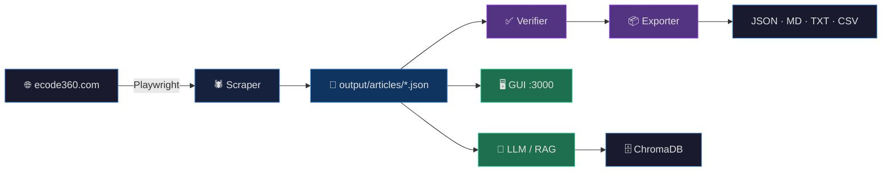

<p align="center">
  <h1 align="center">🏛️ Crescent City Municipal Code</h1>
  <p align="center">
    <strong>Scrape · Verify · Export · View · Chat</strong>
    <br />
    Complete pipeline for the Crescent City, CA municipal code from
    <a href="https://ecode360.com/CR4919">ecode360.com</a>
  </p>
  <p align="center">
    <a href="https://github.com/docxology/crescent-city"></a>
    <a href="#-quick-start"></a>
    <a href="docs/modules/llm.md"></a>
    <a href="LICENSE"></a>
    <a href="#-test-suite"></a>
  </p>
</p>

---

## ✨ What This Does

| Stage | Description | Docs |
|:------|:------------|:----:|
| 🕷️ **Scrape** | Downloads all **242 articles** (2194 sections) via Playwright with Cloudflare bypass | [→](docs/modules/scraping.md) |
| ✅ **Verify** | SHA-256 integrity checks + TOC cross-reference + live re-fetch sampling | [→](docs/modules/verification.md) |
| 📦 **Export** | JSON · Markdown · plain text · CSV index | [→](docs/modules/export.md) |
| 🖥️ **View** | Web viewer with TOC navigation, search, analytics dashboard, dark/light mode | [→](docs/modules/gui.md) |
| 💬 **Chat** | Ollama-powered RAG with ChromaDB vector store and source citations | [→](docs/modules/llm.md) |

---

## 🏗️ Architecture



> 📐 **Full architecture details**: [docs/architecture.md](docs/architecture.md) — data flow diagram, module dependency graph, directory structure

---

## 🚀 Quick Start

```bash
# Install
bun install

# Run the full pipeline: scrape → verify → export
bun run all

# Launch the web viewer
bun run gui          # → http://localhost:3000
```

> 📖 **Detailed setup**: [start_here.md](start_here.md) — step-by-step from prerequisites to RAG chat

---

## 🖥️ Web Viewer Features

Launch with `bun run gui` and open **<http://localhost:3000>**:

| Feature | Description |
|:--------|:------------|
| 📋 **TOC Tree** | Collapsible table of contents with 2486 nodes |
| 📖 **Section Viewer** | Formatted legal text with legislative history |
| 🔍 **Full-Text Search** | Instant keyword search with relevance ranking |
| 🌗 **Dark / Light Mode** | Toggle between themes |
| ✨ **AI Summaries** | Per-section legal summaries via Ollama |
| 💬 **RAG Chat** | Ask questions, get cited answers from the municipal code |
| 📊 **Analytics** | Bar charts, PCA scatter plot, word loadings, clustering |

> 🔧 **GUI internals**: [docs/modules/gui.md](docs/modules/gui.md) — routes, search engine, analytics pipeline

---

## 💬 LLM / RAG Chat

```bash
# Start prerequisites
ollama serve &
chroma run --path chroma_data &

# Index sections into vector store
bun run index

# Chat interactively or run a single query
bun run chat
bun run query "What are the zoning setback requirements?"
```

The RAG pipeline embeds questions via `nomic-embed-text`, retrieves the top-10 most relevant chunks from ChromaDB, and generates cited answers via `gemma3:4b`.

> 🔧 **LLM internals**: [docs/modules/llm.md](docs/modules/llm.md) — config, chunking strategy, embedding pipeline

---

## 📦 Export Formats

| Format | Output | Description |
|:-------|:-------|:------------|
| **JSON** | `crescent-city-code.json` | All sections with full metadata |
| **Markdown** | `markdown/` | Organized by Title/Chapter with cross-links |
| **Text** | `crescent-city-code.txt` | Plain text corpus for NLP |
| **CSV** | `section-index.csv` | Section index with GUIDs |

> 🔧 **Export details**: [docs/modules/export.md](docs/modules/export.md)

---

## 🔒 Integrity Guarantees

- 🔐 Every article page **SHA-256 hashed** at scrape time
- 🔄 Verification **re-computes hashes** from saved files and compares
- 📋 Every section in the official TOC **cross-referenced** against scraped data
- 🌐 Random sample **re-fetched from live site** to confirm freshness
- ⏱️ Manifest records **exact timestamps** for audit trail
- 💾 **Resume support** — interrupt and restart safely

> 🔧 **Verification details**: [docs/modules/verification.md](docs/modules/verification.md)

---

## 📂 Project Structure

```
src/
  types.ts              # Shared TypeScript interfaces
  constants.ts          # URLs, paths, rate limits (env-overridable)
  utils.ts              # Hash, flatten, HTML, CSV, filename utilities
  logger.ts             # Structured logger (LOG_LEVEL env variable)
  browser.ts            # Playwright lifecycle + Cloudflare bypass
  toc.ts                # TOC fetcher + tree utilities
  content.ts            # Page scraper + section extraction
  scrape.ts             # Scraper orchestrator with resume
  verify.ts             # Verification engine
  export.ts             # Multi-format exporter
  monitor.ts            # Municipal code change detection
  news_monitor.ts       # RSS news aggregator (Times-Standard, Lost Coast, Humboldt Times)
  gov_meeting_monitor.ts # City council / planning / harbor meeting tracker
  domains.ts            # Intelligence domain cross-references (emergency, business, etc.)
  alerts/               # Real-time alert integrations
    noaa_tsunami.ts     # NOAA CAP tsunami warning monitor
    usgs_earthquake.ts  # USGS earthquake monitor (coastal, > 4.0M)
    nws_weather.ts      # NWS coastal weather alert monitor
  api/                  # API middleware
    middleware.ts       # Rate limiting, API key auth, request logging
  shared/               # Path resolution + data loading
  gui/                  # HTTP server, routes, search, analytics
  llm/                  # Ollama, ChromaDB, embeddings, RAG
tests/                  # Unit test suite (bun:test, zero-mock policy)
docs/                   # Full documentation suite
output/                 # Scraped data (gitignored)
```

---

## 📚 Municipal Code Structure

The Crescent City Code of Ordinances covers **17 titles** across **242 articles**:

<details>
<summary><strong>📜 View all 17 titles + appendices</strong></summary>

| Title | Subject | Chapters |
|:------|:--------|:--------:|
| 1 | General Provisions | 7 |
| 2 | Administration & Personnel | 14 |
| 3 | Revenue and Finance | 8 |
| 4 | *(Reserved)* | — |
| 5 | Business Taxes & Licenses | 26 |
| 6 | Animal Control | 3 |
| 7 | *(Reserved)* | — |
| 8 | Health and Safety | 12 |
| 9 | Public Peace & Welfare | 6 |
| 10 | Vehicles and Traffic | 16 |
| 11 | *(Reserved)* | — |
| 12 | Streets & Sidewalks | 14 |
| 13 | Public Services | 16 |
| 14 | Procurement Procedures | 8 |
| 15 | Buildings & Construction | 12 |
| 16 | Subdivisions | 10 |
| 17 | Zoning | 25 |

**Plus**: Appendix A (Employer-Employee Relations), Appendix B (Sewer Manual), Statutory References, Cross Reference Table, Ordinance List

</details>

---

## 🧪 Test Suite

```
135 pass · 0 fail · 435 assertions · 15 test files
```

| Test File | Module | Tests |
|:----------|:-------|:-----:|
| `utils.test.ts` | Hash, flatten, shuffle, HTML, CSV, filename | 22 |
| `toc.test.ts` | Article pages, sections, TOC summary | 10 |
| `shared-paths.test.ts` | All output path constants | 10 |
| `constants.test.ts` | Project constants | 5 |
| `constants-extended.test.ts` | Configurable constants + env overrides | 10 |
| `llm-config.test.ts` | LLM configuration values | 8 |
| `shared-data.test.ts` | Data loading functions | 6 |
| `search.test.ts` | Search engine + relevance | 8 |
| `analytics.test.ts` | PCA, K-means, word loadings | 7 |
| `routes.test.ts` | API route handlers | 7 |
| `logger.test.ts` | Structured logger levels + output | 6 |
| `embeddings.test.ts` | Text chunking for embeddings | 7 |
| `export.test.ts` | CSV, Markdown, filename formatting | 12 |
| `domains.test.ts` | Intelligence domains data + search | 14 |
| `monitor.test.ts` | Monitor report types + validation | 3 |

Run all tests: `bun test`

---

## ⚡ Commands Reference

| Command | Description |
|:--------|:------------|
| `bun install` | Install dependencies |
| `bun run scrape` | Scrape municipal code (resumable) |
| `bun run verify` | Verify data integrity |
| `bun run export` | Export JSON, Markdown, TXT, CSV |
| `bun run all` | Scrape → Verify → Export |
| `bun run gui` | Web viewer → <http://localhost:3000> |
| `bun run index` | Index into ChromaDB vector store |
| `bun run chat` | Interactive RAG chat |
| `bun run query "..."` | Single RAG query |
| `bun run status` | Check service status |
| `bun run monitor` | Municipal code change detection |
| `bun run news` | Fetch local news RSS feeds |
| `bun run gov-meetings` | Scrape city meeting agendas/minutes |
| `bun run alerts:tsunami` | Poll NOAA CAP tsunami warnings |
| `bun run alerts:earthquake` | Poll USGS earthquake feed |
| `bun run alerts:weather` | Poll NWS coastal weather alerts |
| `bun test` | Run test suite |

---

## ⚙️ Configuration

All LLM settings support environment variable overrides:

| Variable | Default | Description |
|:---------|:--------|:------------|
| `OLLAMA_URL` | `http://localhost:11434` | Ollama API server |
| `EMBEDDING_MODEL` | `nomic-embed-text` | Embedding model |
| `CHAT_MODEL` | `gemma3:4b` | Chat / summarization model |
| `CHROMA_URL` | `http://localhost:8000` | ChromaDB server |
| `PORT` | `3000` | GUI server port |
| `LOG_LEVEL` | `info` | Logger verbosity (debug/info/warn/error) |

> 🔧 **Full configuration reference**: [docs/configuration.md](docs/configuration.md) — constants, LLM tuning, analytics parameters

---

## 📖 Documentation

| Document | Description |
|:---------|:------------|
| 📐 [Architecture](docs/architecture.md) | System design, data flow, module dependency graph |
| 🕷️ [Scraping](docs/modules/scraping.md) | Browser, TOC, content extraction, scraper orchestrator |
| ✅ [Verification](docs/modules/verification.md) | SHA-256 checks, section presence, live re-fetch |
| 📦 [Export](docs/modules/export.md) | JSON, Markdown, plain text, CSV output |
| 🖥️ [GUI](docs/modules/gui.md) | Web viewer, API routes, search, analytics |
| 💬 [LLM](docs/modules/llm.md) | Ollama, ChromaDB, embeddings, RAG pipeline |
| 🔗 [Shared](docs/modules/shared.md) | Path resolution, data loading layer |
| 📋 [API Reference](docs/api-reference.md) | All exported functions, interfaces, types |
| ⚙️ [Configuration](docs/configuration.md) | Environment variables, constants, tuning |
| 🚀 [Start Here](start_here.md) | Step-by-step setup guide |

---

## ⚠️ Known Limitations

- ecode360.com uses **Cloudflare Turnstile** — the scraper uses a non-headless browser with anti-detection; timing can vary
- **6 "part"** and **17 "subarticle"** intermediate TOC nodes aren't scrapable pages but their child sections are collected recursively
- Content changes on ecode360 are **not auto-detected** — re-scrape to get updates
- LLM answer quality depends on the Ollama model used — larger models give better results

---

<p align="center">
  <a href="LICENSE"><strong>CC BY-SA 4.0</strong></a> · <a href="CONTRIBUTING.md"><strong>Contributing</strong></a> · <a href="start_here.md"><strong>Start Here</strong></a> · <a href="docs/README.md"><strong>Documentation</strong></a>
</p>
