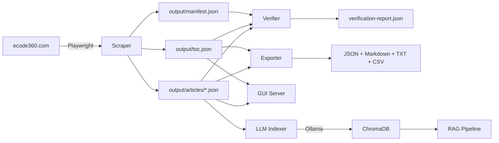
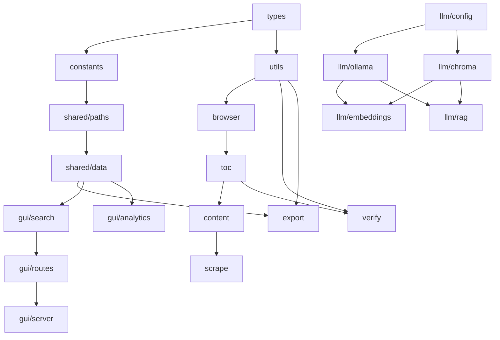

# Architecture

## System Overview

The Crescent City Municipal Code project is a complete pipeline for scraping, verifying, exporting, viewing, and querying municipal code from [ecode360.com](https://ecode360.com/CR4919).

```
ecode360.com/CR4919
        │
   ┌────▼────┐
   │ Scraper  │  Playwright + Cloudflare bypass
   └────┬────┘
        │
  output/articles/*.json  (242 articles, 2194 sections)
        │
   ┌────▼────┐
   │ Verifier │  SHA-256 + TOC cross-reference + live re-fetch
   └────┬────┘
        │
   ┌────▼────┐
   │ Exporter │  JSON, Markdown, plain text, CSV
   └────┬────┘
        │
   ┌────┴────┐
   │         │
┌──▼──┐  ┌──▼──┐
│ GUI │  │ LLM │
│:3000│  │ RAG │
└─────┘  └─────┘
```

## Data Flow



## Module Dependency Graph



## Directory Structure

```
src/
  types.ts              # All TypeScript interfaces
  constants.ts          # Centralized constants
  utils.ts              # Pure utilities (hash, flatten, HTML, CSV, filename)
  browser.ts            # Playwright lifecycle + Cloudflare bypass
  toc.ts                # TOC fetcher + tree utilities
  content.ts            # Page scraper + section extraction
  scrape.ts             # Scraper orchestrator with resume
  verify.ts             # Verification engine
  export.ts             # Multi-format exporter
  shared/
    paths.ts            # Path resolution
    data.ts             # Data loading layer
  gui/
    server.ts           # Bun.serve() HTTP server
    routes.ts           # API route handlers
    search.ts           # In-memory full-text search
    analytics.ts        # PCA + stats computation
    static/index.html   # Single-page app
  llm/
    config.ts           # LLM configuration
    ollama.ts           # Ollama API wrapper
    chroma.ts           # ChromaDB client
    embeddings.ts       # Indexing pipeline
    rag.ts              # RAG pipeline
    index.ts            # CLI entry point
tests/
  utils.test.ts         # 22 tests
  constants.test.ts     # 5 tests
  toc.test.ts           # 10 tests
  shared-paths.test.ts  # 10 tests
  shared-data.test.ts   # 6 tests
  search.test.ts        # 8 tests
  analytics.test.ts     # 7 tests
  llm-config.test.ts    # 8 tests
  routes.test.ts        # 7 tests
docs/                   # This documentation
output/                 # Scraped data (gitignored)
```

## Runtime Dependencies

| Dependency | Purpose | Required |
|-----------|---------|----------|
| [Bun](https://bun.sh) | Runtime + test runner | Always |
| [Playwright](https://playwright.dev) | Browser automation for scraping | Scraper only |
| [Ollama](https://ollama.ai) | Embeddings + chat models | LLM features |
| [ChromaDB](https://trychroma.com) | Vector storage | LLM features |
